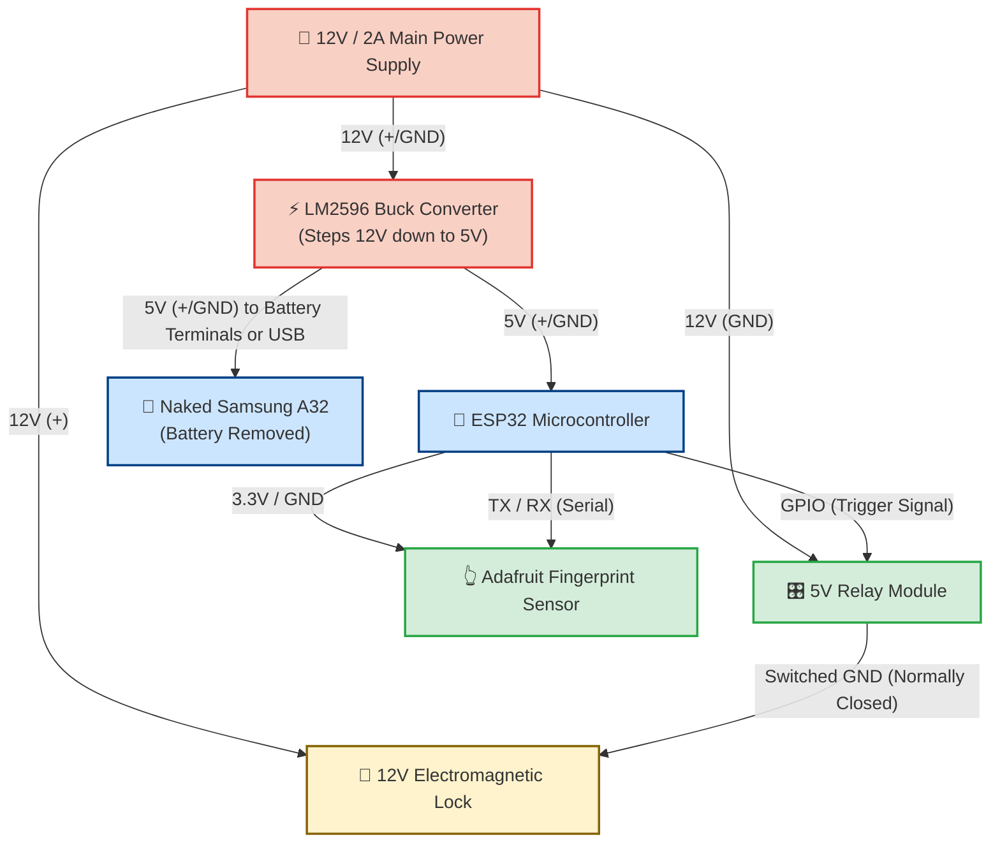

# 📱 Naked Samsung A32 Prototype: Circuit & Enclosure

This document outlines the 2D CAD blueprint and the internal electrical circuit wiring for using a stripped-down Samsung Galaxy A32 inside the custom HP MJF enclosure.

## 1. 2D Architectural CAD Concept
Here is the 2D technical layout for the "Shadow Box" style enclosure, designed to perfectly friction-fit the Samsung A32 motherboard and screen.

*Notice the side profile: The front faceplate snaps over the top, leaving an internal cavity specifically dimensioned for the ESP32, Relay, and the buck converter wiring.*

---

## 2. The Internal Circuit Diagram
When stripping the Samsung A32, the most critical step is managing power. Since you are removing the internal lithium battery (to prevent swelling and fire risks), you must supply a clean 5V directly to the phone. 

Here is the master wiring schematic mapping the 12V building power down to the components:

### Circuit Wiring Notes:
1. **The Relay (Fail-Safe vs. Fail-Secure):** The ESP32 triggers the relay. Because this is a magnetic door lock, the relay must be wired as **Normally Closed (NC)**. The ESP32 sends a signal to *break* the circuit, which drops the magnetic field and opens the door. If the power goes out, the door opens (Fail-Safe).
2. **Phone Powering:** Depending on the exact sub-board of the Samsung A32, some phones refuse to boot if they don't detect the battery's thermistor pin. You may need to leave the small battery BMS (Battery Management System) strip attached to the motherboard, cut off the actual lithium pouch, and solder the 5V buck converter output directly to the bare BMS tabs. 
3. **ESP32 Power:** The ESP32 can be powered by the same 5V rail as the phone by plugging into the `VIN` or `5V` pin on the ESP32 dev board.
