# 🛡️ AuraLock2 - Lock Reliability & Biometric Calibration Strategy
**Target State: Code Green (100% Operational Reliability)**

This document details the diagnostic steps, root causes, and implementation blueprints to resolve the two primary issues reported:
1. **Door Lock Fail-To-Open (BLE/Connection Drops)**
2. **Biometric Ambiguous Matching (False Rejections & MFA Prompts)**

---

## 🗺️ System Topology

```mermaid
graph TD
    A[Terminal App - Android] -->|1. Capture & Post Frame| B(Node.js Backend)
    B -->|2. Forward to AI Engine| C[Python Biometric API]
    C -->|3. Cosine Distance Comparison| D[(Supabase Face Templates)]
    C -->|4. Liveness Check| E[Gemini Flash API]
    B -->|5. Match Verified| A
    A -->|6. Direct BLE Command| F[ESP32 Door Lock]
```



---

## 🔓 Part 1: Resolving Lock Fail-To-Open (BLE Connection Drops)

### 🔍 Root Cause Analysis
1. **Single-Attempt Connection**: The current `TerminalHome.jsx` code makes a single `BleClient.connect(BLE_MAC)` call. If a BLE packet drops, a scan window is missed, or the ESP32 is advertising slowly, the connection immediately throws an error and fails without retrying.
2. **ESP32 BLE Stack Congestion**: The ESP32 Bluetooth stack is prone to freezing or rejecting new connections if a previous connection was not cleanly disconnected, or if the terminal app scans for advertisements too frequently while a connection is being established.
3. **No Automatic Disconnect Guard**: If the `setTimeout` to relock is interrupted or the app crashes mid-cycle, the BLE connection stays open, blocking any future connections.

---

### 🛠️ Optimization Blueprint (Terminal App)
We will refactor `triggerDoorUnlock` in `terminal-app/src/TerminalHome.jsx` to introduce:
* **Retry Loop (Exponential Backoff)**: Attempt to connect up to 3 times before failing.
* **Auto-Cleanup / Disconnect Guard**: Force a `BleClient.disconnect(BLE_MAC)` in a `finally` block to ensure the ESP32 is never left locked in an active session.

#### Proposed React Implementation:
```javascript
const triggerDoorUnlock = async () => {
    let connected = false;
    const MAX_RETRIES = 3;
    
    setDoorState('unlocked');
    setLastDoorUpdate(new Date().toLocaleTimeString('en-IN', { hour: '2-digit', minute: '2-digit', hour12: true }));

    try {
        console.log('Initializing BleClient...');
        try { await BleClient.initialize(); } catch (e) {}

        // Connection Retry Loop
        for (let attempt = 1; attempt <= MAX_RETRIES; attempt++) {
            try {
                console.log(`Connecting to lock (Attempt ${attempt}/${MAX_RETRIES}): ${BLE_MAC}`);
                await BleClient.connect(BLE_MAC);
                connected = true;
                break; // Connection succeeded!
            } catch (connErr) {
                console.warn(`Connection attempt ${attempt} failed: ${connErr.message}`);
                if (attempt === MAX_RETRIES) throw connErr;
                await new Promise(r => setTimeout(r, 1000 * attempt)); // Exponential backoff (1s, 2s)
            }
        }

        // Write Unlock Command (ON)
        const buffer = new ArrayBuffer(2);
        const viewData = new DataView(buffer);
        viewData.setUint8(0, 'O'.charCodeAt(0));
        viewData.setUint8(1, 'N'.charCodeAt(0));
        console.log('Sending direct ON GATT command...');
        await BleClient.write(BLE_MAC, DOOR_SERVICE_UUID, DOOR_CHAR_UUID, viewData);

        // Hold open for 5.5 seconds then lock
        await new Promise(resolve => setTimeout(resolve, 5500));

        // Write Lock Command (OFF)
        const offBuffer = new ArrayBuffer(3);
        const offView = new DataView(offBuffer);
        offView.setUint8(0, 'O'.charCodeAt(0));
        offView.setUint8(1, 'F'.charCodeAt(0));
        offView.setUint8(2, 'F'.charCodeAt(0));
        console.log('Sending OFF GATT command...');
        await BleClient.write(BLE_MAC, DOOR_SERVICE_UUID, DOOR_CHAR_UUID, offView);

    } catch (err) {
        console.error('❌ BLE Operation Failed:', err);
        setMessage('Lock connection failed. Please try again.');
    } finally {
        if (connected) {
            try {
                console.log('Disconnecting BLE session cleanly...');
                await BleClient.disconnect(BLE_MAC);
            } catch (discErr) {
                console.error('Failed to disconnect BLE cleanly:', discErr);
            }
        }
        setDoorState('locked');
        setLastDoorUpdate(new Date().toLocaleTimeString('en-IN', { hour: '2-digit', minute: '2-digit', hour12: true }));
    }
};
```

---

## 🧬 Part 2: Resolving Biometric Ambiguous Matching

### 🔍 Root Cause Analysis
In `edge/biometric_api.py`, the matching algorithm calculates the **Euclidean Distance** between the scanned face and all registered face vectors:
* **Strict Threshold**: `min_distance > 0.55` (values above this are considered unrecognized).
* **Ambiguity Check**: If the distance gap between the closest match and the second closest match is less than `0.05` (`gap < 0.05`), the request is rejected as an **Ambiguous Match** (`AMBIGUOUS_MATCH`) to prevent false validation of similar-looking individuals.

This issue is typically caused by:
1. **Low-Quality Enrolment Image**: If the initial registered photo was taken in bad lighting or at an angle, the facial vector becomes less distinct, pulling it closer to other employees' vectors.
2. **Tight Ambiguity Gap (0.05)**: The gap parameter is highly sensitive. For small teams, this gap can be safely widened or calibrated.
3. **MFA Loop Block**: The terminal app lacks a fingerprint sensor reader, so when `AMBIGUOUS_MATCH` triggers `MFA_REQUIRED` (requiring a fingerprint scan), the flow hangs.

---

### 🛠️ Calibration Blueprint (AI Engine & Backend)

#### 1. Fine-Tune Ambiguity Parameters
We will adjust the parameters in `edge/biometric_api.py` to be slightly more forgiving while maintaining high security, and log details of similar employees to speed up diagnostics:

```python
# ── Proposed Change in edge/biometric_api.py ──
# 1. Adjust AMBIGUITY_GAP to 0.04 to decrease false-positives
AMBIGUITY_GAP = 0.04

# 2. Check closest distances
if len(distances) > 1:
    sorted_distances = np.sort(distances)
    gap = sorted_distances[1] - min_distance
    
    # Only declare ambiguity if BOTH matches are extremely close (under 0.50 distance)
    if gap < AMBIGUITY_GAP and min_distance < 0.50:
        is_ambiguous = True
        print(f"[REJECTED] Ambiguity detected! Closest: {matched_emp['name']} vs {FACE_METADATA[np.argsort(distances)[1]]['name']}. Gap: {gap:.4f}")
```

#### 2. Re-enrollment SOP
For employees experiencing persistent ambiguous matching:
1. Delete their current face data via the Admin Panel.
2. Re-enroll their face in a **well-lit environment**, looking directly at the camera with a neutral expression.

---

## 📈 Part 3: Path to "Code Green" Execution Plan

| Step | Action | Files Modified | Verification Method |
|:---|:---|:---|:---|
| **1. BLE Resiliency** | Implement exponential backoff, auto-disconnect, and scan coordination. | `TerminalHome.jsx` | Deploy to device and monitor `adb logcat` during 10 consecutive mock scans. |
| **2. Calibrate AI Engine** | Lower `AMBIGUITY_GAP` and refine ambiguity logic to require close secondary proximity. | `biometric_api.py` | Run unit tests (`test_expert_biometrics.py`) to verify mock ambiguous faces. |
| **3. Clean Disconnects** | Add a timeout sentinel to prevent ESP32 from freezing due to hanging sockets. | `door_lock.ino` / ESP32 | Perform stress test with active scans. |
| **4. Build & Verify** | Recompile APK, distribute, and verify the production build. | `build_apk.ps1` | End-to-end user tests using USB debugging. |
