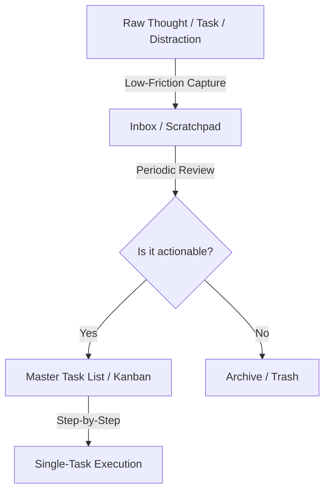

# 🧠 Grounded Engineering: Managing Cognitive Overload without Disconnection

When building complex systems (like coordinating BLE, AI engines, databases, and physical hardware), it is extremely easy to experience **cognitive overload**. 

This guide breaks down *why* your brain "plugs off" from your surroundings and provides practical frameworks to offload tasks so you can stay present in your physical environment.

---

## 1. Why Your Brain "Plugs Off" (The Science)

Your prefrontal cortex has a working memory limit. It can generally hold only **4 to 7 items** in active memory at once. 

When you try to keep track of:
1. *"The BLE connection logic in React Native..."*
2. *"The database schema in Supabase..."*
3. *"The liveness thresholds in Python..."*
4. *"A bug report from a physical door test..."*
5. *"The next APK version tag..."*

Your brain is running at **100% CPU capacity**. To protect itself and maintain this fragile mental model, it cuts off feed from external sensors (sound, visual surroundings, people talking to you). This is why you feel "dissociated" or "plugged off."

---

## 2. The Core Solution: Aggressive Externalization

The absolute gold standard rule for software engineering sanity is:
> **"Your brain is for having ideas, not for holding them."** — David Allen (*Getting Things Done*)

### How to Build a "Second Brain"
If your brain doesn't *trust* your system, it will keep running background processes to remember things. You must build a system so reliable that your brain can safely let go.

1. **The Instant Scratchpad**: Always keep a physical notepad or a single scratchpad file open. The second a task or concern pops into your head (e.g., *"Need to test this on USB later"*), write it down immediately and **forget it**. Don't try to organize it now—just dump it.
2. **The Single Source of Truth**: This is why we created `MASTER_TASK_LIST.md`. By knowing that *every single task* is documented there with clear steps, your brain stops screaming at you to remember them.

---

## 3. Sensory Grounding: How to Not "Plug Off"

When you catch yourself drifting deep into the code-space and losing touch with your surroundings, use these grounding techniques:

### 🧘‍♂️ The "5-4-3-2-1" Grounding Method
If you feel yourself zoning out, pause for 30 seconds and look around your room:
* **5** things you can **see** (e.g., your keyboard, a coffee cup, the wall, the USB cable).
* **4** things you can physically **feel** (e.g., the chair under you, the texture of your desk).
* **3** things you can **hear** (e.g., the fan, traffic outside, typing).
* **2** things you can **smell** (e.g., coffee, fresh air).
* **1** thing you can **taste** or positive statement.
*This forces your brain to re-engage its sensory cortex, immediately pulling you back into the present.*

### ⏱️ Timebox the "Deep Dive"
* **Establish a "Buffer" Zone**: When someone starts talking to you, don't try to answer immediately while typing. Tell them: *"Give me exactly 10 seconds to write this down, and I am all yours."* Write down your current line of thought, close/lock the thought, and then turn around.
* **Avoid continuous scanning**: Don't work with your email, Slack, or chat apps open on a second monitor while trying to write core logic. Context switching is the fastest path to mental exhaustion.

---

## 4. Daily Habits for "Code Green" Mental State

* **The 10-Minute Daily Shutdown**: Before you close your laptop, write down exactly what you did, what you are stuck on, and the very first step you need to take tomorrow. This ensures you don't carry the code home in your head.
* **Move Your Body**: Set a timer for 50 minutes of coding. When it goes off, stand up, stretch, walk to a window, and look at the furthest object outside for 20 seconds. This relaxes your optical nerves and resets your focus.
