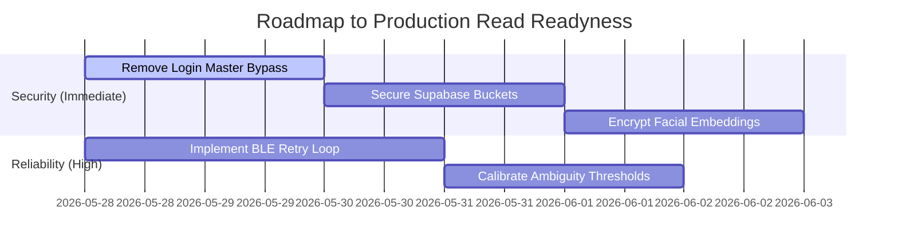

# 📊 AuraLock2 - Unified SWOT Analysis & Security Audit

An exhaustive strategic and architectural evaluation of the AuraLock2 ecosystem, focusing on the integration of mobile client, local/cloud Node.js backend, remote biometric FastAPI service, and ESP32 hardware interactions.

---

## 🗺️ SWOT Matrix at a Glance

| Strengths (💪) | Weaknesses (📉) |
| :--- | :--- |
| **• Modern Dual-Service Architecture**: Node.js core API + dedicated Python AI Edge Service provides clear separation of business logic and machine learning. **• Advanced Liveness Guard**: Dual-layered spoofing detection using OpenCV frame verification and Google Gemini 1.5 Flash. **• Native Mobile BLE Direct Unlock**: High-performance local BLE GATT communication bypasses cloud latency for actual physical door triggers. **• Offline Hardware Backup**: Multi-modal verification (biometric + fingerprint) running locally on physical hardware for offline resilience. | **• BLE Connection Sensitivity**: Single-attempt connection in WebView can cause fail-to-unlock events if interference occurs. **• Ambiguity Sensitivity**: High-dimensional dlib vectors sometimes conflict, triggering unnecessary MFA loops. **• Fragmented Repository Scope**: Codebase split across Javascript, React, C++, and Python leads to high maintenance overhead. **• Cloud Engine Latency**: Long cold-start times on remote biometric microservices can delay check-ins. |
| **Opportunities (🚀)** | **Threats (⚠️)** |
| **• Local Edge ML Deployment**: Migration from cloud-based Python microservice to on-device Tensorflow Lite/ONNX models. **• Event Sourced Attendance**: Transitioning to immutable `access_logs` and terminal directional identifiers (`terminal_in` / `terminal_out`). **• Commercial Kiosk Platform**: Packaging the React Native codebase onto cost-efficient Raspberry Pi + touchscreen enclosures. **• HRMS Enterprise Webhooks**: Native sync hooks for platforms like Zoho People, Keka, and BambooHR. | **• Compliance & Privacy (DPDP Act)**: Storing unencrypted 128D facial vectors and public bucket image links. **• Spoofing Vectors**: Relying on "Fail-Open" Gemini API timeout logic could allow screen bypasses during network degradation. **• Master Bypass Exploits**: Development shortcuts left in server code (e.g. hardcoded master credentials). |

---

## 🔍 Deep-Dive Analysis

### 💪 Strengths (Internal, Helpful)
* **Hybrid Connectivity Model**: Splitting authentication into cloud-based verification and local BLE door unlocking offers the best of both worlds. The cloud backend manages user identities and databases, while the physical phone uses BLE directly at the door to trigger the lock, eliminating cloud-to-door network delays.
* **Gemini Liveness Layer**: Incorporating `gemini-1.5-flash` for contextual liveness checking is a robust defense against 2D printouts and screen-replay spoofing attacks that deceive standard OpenCV cascades.
* **Battery-Optimized Client App**: Transitioning from constant 2-second camera streaming to a "Tap to Wake" scanning loop drastically extends device battery life on wall-mounted hardware.

### 📉 Weaknesses (Internal, Harmful)
* **Brittle Timeout Coordination**: The Webview container has tighter timeouts than the cloud biometric backend's retry limit, causing the UI to show "Engine Offline" even if the server is actively waiting for a cold cloud function to wake up.
* **Lack of BLE Retry Resiliency**: The direct BLE controller lacks a retry-and-recovery loop, leaving the lock susceptible to failing if the initial GATT connection packet drops.
* **Monolithic Server Structure**: `server.js` spans over 1,100 lines of mixed routes, controllers, and PDF generation, increasing regression risk during upgrades.

### 🚀 Opportunities (External, Helpful)
* **Recessed "Floating Glass" Kiosk Enclosure**: Transitioning the physical interface from handheld phones to a structured wall-recessed housing with a Raspberry Pi + USB Camera drops hardware deploy cost to ~$75 per portal.
* **Biometric Vector Encryption**: Implementing Fernet/AES-256 encryption at-rest for vectors in Supabase secures identity profiles against external database breaches.
* **Immutable Access Logging**: Overhauling the attendance schema into an Event Sourced ledger resolves timezone drifts and incorrect check-out records.

### ⚠️ Threats (External, Harmful)
* **Regulatory Penalties (DPDP 2023 / GDPR)**: Public URLs for biometrics storage buckets expose physical camera scans to open access if URLs are guessed or leaked.
* **Gemini Timeout Spoofing**: Since the AI liveness engine "fails open" on API timeouts for reliability, attackers could intentionally jam or flood the network to bypass liveness checks.

---

## 🎯 Actionable Roadmap to "Code Green"

### 1. Remove Master Login Bypass (SEC-1)
* **Vulnerability**: A development master override grants full admin access to the panel if specific test credentials are entered, bypassing bcrypt and Supabase lookup.
* **Remediation**: Remove the hardcoded conditional checks from `backend/server.js` and enforce native database credentials verified via JSON Web Tokens.

### 2. Close the Liveness "Fail-Open" Loophole (STAB-3)
* **Risk**: High-security settings cannot accept a "Fail-Open" on Gemini API failure.
* **Remediation**: Introduce a toggle in `config.json` (`STRICT_LIVENESS_ENFORCEMENT: true/false`). If true, a Gemini timeout forces a rejected scan, prompting the user to try again, rather than letting them pass.

### 3. Restrict Supabase Storage Bucket Access (SEC-2)
* **Risk**: Public biometric buckets allow direct unauthorized access to employee photos.
* **Remediation**: Convert the storage bucket type to Private in the Supabase control panel, and generate signed, short-lived URLs (valid for 60 seconds) during the enrollment and verification flows.
