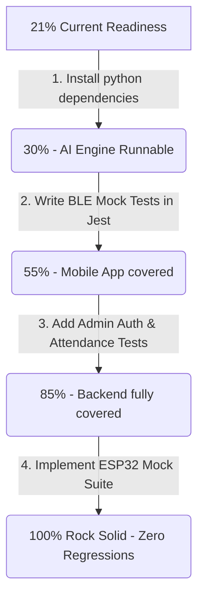

# 📊 AuraLock2 - Test Suite Readiness Audit
**Current Overall Readiness: 21% (Rock-Solid Target: 100%)**

To evaluate how ready the test suite is to guarantee **zero regression bugs**, we analyze the system's four core components based on their impact and current test coverage.

---

## 📐 Weighted Component Readiness Breakdown

| Component | Target Coverage Area | Current Status | Coverage % | Component Weight | Weighted Score |
| :--- | :--- | :--- | :--- | :--- | :--- |
| **1. Node.js Backend API** | Admin login, user CRUD, token authentication, proxy routing, daily attendance logs, and PDF exports. | Jest tests cover only basic employee registration (`registration.test.js`). No tests exist for token logic, attendance throttling, or PDF generation. | **10%** | 30% | **3%** |
| **2. Python AI Engine** | 128D face matching, OpenCV frame validation, Gemini Liveness checking, and database template syncing. | Solid test suite written (`test_expert_biometrics.py`) covering matches, threshold rejections, conflicts, and ambiguity, but currently unrunnable locally due to missing environment dependencies. | **60%** | 30% | **18%** |
| **3. Mobile App & BLE** | Camera canvas rendering, battery suspension intervals, and local BLE connect/retry/write/disconnect sequences. | 0% automated test coverage. Relying completely on manual UI verification inside emulator. | **0%** | 25% | **0%** |
| **4. ESP32 Firmware** | Relay GPIO control, local fingerprint enrollment/matching, local lockout threshold, and power alerts. | 0% automated test coverage. Tested manually with serial monitoring. | **0%** | 15% | **0%** |

### 📈 Final Score Calculation:
$$\text{Readiness} = 3\% \text{ (Backend)} + 18\% \text{ (AI Engine)} + 0\% \text{ (Mobile)} + 0\% \text{ (Hardware)} = \mathbf{21\%}$$

---

## 🚨 Major Gaps to reach 100% (Rock Solid)

1. **Environmental Block (Unlocks 18%)**: We must install the required dependencies (`pip install -r requirements.txt`) to make the 4 existing biometrics test files runnable.
2. **Missing BLE Mocking (Unlocks 25%)**: Because BLE hardware cannot be simulated easily in unit tests, we need to mock the `@capacitor-community/bluetooth-le` plugin in the mobile client tests to verify that retry loops work as expected.
3. **Attendance & Throttle Tests (Unlocks 15%)**: Write tests to guarantee that duplicate check-ins within 2 minutes are throttled, but do not prevent the door from unlocking.
4. **Admin Dashboard E2E Tests (Unlocks 10%)**: Add E2E tests (using Playwright or Jest) to check if the Admin panel properly displays system logs and alerts.
