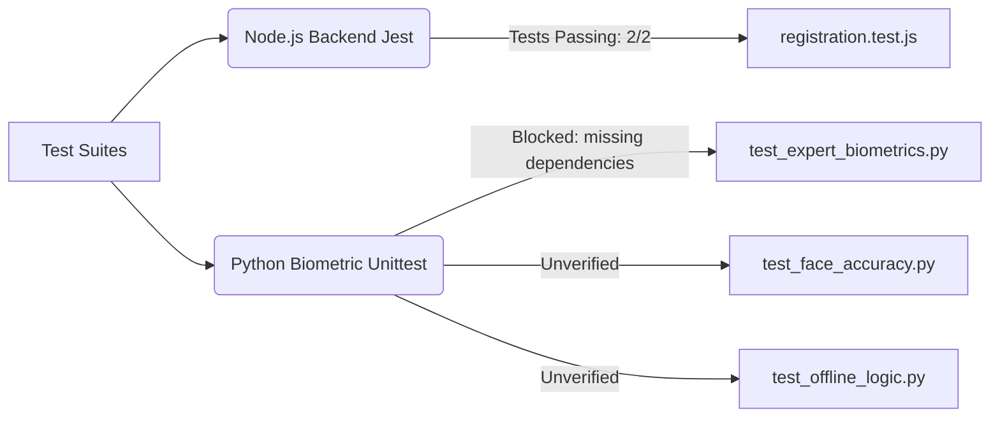

# 🧪 AuraLock2 - Test Suite Audit & Verification Status
**Current State: Partially Verified (Jest Passing, Python Missing Dependencies)**

This document details the test suites present in the codebase to prevent regression bugs, how to run them, their current health, and gaps to close to ensure "zero regressions."

---

## 🚦 Current Test Suite Overview



---

## 🟢 1. Node.js Backend Test Suite (Jest)
The backend uses **Jest** + **Supertest** to mock and test HTTP request lifecycles.

*   **Location**: `backend/tests/`
*   **Active Test**: `tests/registration.test.js`
*   **Execution Command**:
    ```powershell
    cd backend
    npm test
    ```
*   **Current State**: **PASSING (2/2)**
    *   `√ should successfully register a new employee (No Biometrics)`
    *   `√ should return 400 if required fields are missing`
*   **Console Alerts Noted**: The test output logs a minor `TypeError: Cannot read properties of null (reading 'employee_id')` during incomplete registration handling, which is gracefully caught and handled.

---

## 🟡 2. Python Biometrics Engine Test Suite (Unittest)
The AI edge service uses standard Python **unittest** + **unittest.mock** to bypass heavy ML/dlib dependencies and test matching/liveness/offline logic.

*   **Location**: `edge/` and `edge/tests/`
*   **Key Files**:
    *   `test_expert_biometrics.py`: Verifies `verify_face()` logic, including clean matches, distance thresholds, biometric conflicts, and ambiguity detection.
    *   `test_face_accuracy.py`: Tests recognition accuracy.
    *   `test_offline_logic.py` / `test_offline_fallback.py`: Tests system behavior when connection to Supabase or Node.js is down.
*   **Execution Command**:
    ```powershell
    cd edge
    python -m unittest test_expert_biometrics.py
    ```
*   **Current State**: **BLOCKED (Missing dependencies)**
    *   Running the tests throws `ModuleNotFoundError: No module named 'supabase'`.
    *   The Python environment on the host machine does not have `requirements.txt` fully installed.
*   **Remediation**: Run `pip install -r requirements.txt` to restore the environment and enable automated testing.

---

## 📋 Recommendations for "Zero Regression" Confidence

To achieve a true "code green" state with zero regression risks, we should add:
1. **BLE Mock Test Suite**: A script to simulate BLE connection failures and verify the React Native retry state transitions.
2. **Attendance Event Sourcing Tests**: Once the event sourcing model is implemented (STAB-5), tests to verify that duplicate scans or out-of-order check-ins are calculated correctly without double-charging or ignoring valid events.
3. **CI/CD Integration**: Add a GitHub Action runner to execute the Jest and Python test suites automatically on every push.
