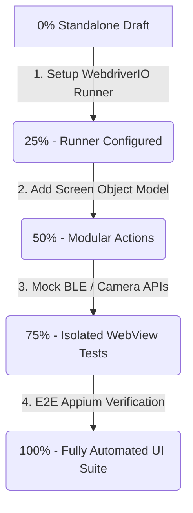

# 📱 AuraLock2 - Client UI Test Suite Status
**Current UI Test Readiness: 0% Automated (Standalone Draft Status)**

The client application is a React single-page app running in a Capacitor WebView container on Android. Testing this requires Appium UI Automation to switch contexts from `NATIVE_APP` to the Chromium `WEBVIEW`.

---

## 📐 UI Test Status Breakdown

| Metric | Status | Details |
| :--- | :--- | :--- |
| **Automation Level** | **0%** | The UI test is a standalone file (`mobile_test.js`) and is **not** connected to any test runner (like Mocha/Jest), CI/CD pipeline, or automated run scripts. |
| **Feature Coverage** | **~5%** | The script only checks if the app can connect via Appium, inspect contexts, and search/click a single button (`Rebuild Cache`) in the Settings pane. |
| **Out-Of-Scope Screens** | **95%** | No automated tests exist for: • **Home View**: Camera loading, idle state transition. • **Check-In/Check-Out Flow**: Simulating successful verification screens. • **Admin PIN Panel**: PIN entry validation and error handling. • **Device Setup**: Modifying configuration/terminal ID inputs. |

---

## 🛠️ The Existing UI Test Script (`mobile_test.js`)

A draft test script exists at `terminal-app/mobile_test.js` using the **WebdriverIO** client. 

### How it Works:
1. Connects to Appium on port `4723`.
2. Inspects available device contexts.
3. Automatically switches to the `WEBVIEW` context if available (standard for Capacitor web-views).
4. Targets the element with the text `Rebuild Cache` and executes a `.click()` action.

### Prerequisite Setup to Run:
To run this test manually, the host machine must have:
* **Appium Server** installed and running on port `4723` (`npm install -g appium`).
* **UiAutomator2 Driver** installed (`appium driver install uiautomator2`).
* An active Android emulator or physical device connected via USB debugging with the app focused.

---

## 📋 Steps to Make Client UI Testing Rock-Solid

To elevate the UI test suite from **0%** to **100%**:

1. **Establish a Test Runner (Gets us to 25%)**: Configure `@wdio/cli` to manage device lifecycles automatically rather than spawning standalone sessions.
2. **Implement Page Object Model (POM) (Gets us to 50%)**: Create helper classes for each screen (`HomeScreen`, `AdminPinScreen`, `SettingsScreen`) to keep test files readable.
3. **Mock WebView APIs (Gets us to 75%)**: Mock Capacitor plugins (like `@capacitor-community/bluetooth-le` and `Camera`) inside the web app during testing to avoid needing real hardware or physical cameras.
4. **End-to-End User Journeys (Gets us to 100%)**: Test the standard user flows:
   * **Admin Login**: Entering PIN `1234` leads to `AdminSelect`.
   * **Incorrect Admin PIN**: Entering `9999` shows the error "Invalid PIN" and locks the panel.
   * **Verification Transition**: Simulating a success response from the server redirects the UI to the check-in success pane.
